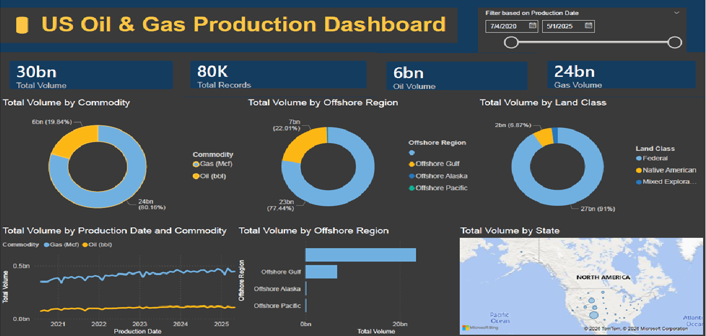
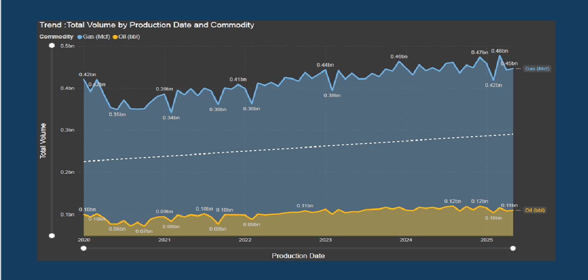

# 🛢️ US Oil & Gas Production Dashboard


A professional interactive Power BI dashboard analyzing 5 years of US federal oil and gas production data (2020–2025). Built using real-world data from the US Office of Natural Resources Revenue (ONRR).

---

## 📸 Dashboard Preview




---

## 📊 Project Overview

This project demonstrates a complete data analytics workflow including data cleaning, DAX query writing, interactive dashboard design, and trend analysis — all built in Microsoft Power BI Desktop using real US government production data.

The dataset and dashboard are directly relevant to the oil and gas industry, covering production volumes across offshore regions, land classifications, and commodity types over a 5-year period.

---

## 🔍 Key Insights

- **Gas dominates production** — Natural gas accounts for 80% of total volume vs 20% for oil
- **Offshore Gulf leads** — The Gulf of Mexico drives 77% of all offshore production
- **Federal land dominates** — 91% of all production comes from federally managed land
- **Upward trend** — Consistent production growth observed from 2020 to 2025

---

## 🛠️ Tools & Techniques Used

| Area | Details |
|---|---|
| Tool | Microsoft Power BI Desktop |
| Data Cleaning | Power Query Editor |
| Calculations | DAX (Measures, Columns, Tables) |
| Visuals | KPI Cards, Donut Charts, Line Chart, Bar Chart, Map |
| Analysis | Trend Line, Interactive Slicers |

---

## 📐 DAX Queries Written

```dax
-- Total production volume
Total Volume = SUM('OGORBcsv'[Volume])

-- Count of records
Total Records = COUNTROWS('OGORBcsv')

-- Oil only
Oil Volume = CALCULATE(SUM('OGORBcsv'[Volume]), 'OGORBcsv'[Commodity] = "Oil (Bbl)")

-- Gas only
Gas Volume = CALCULATE(SUM('OGORBcsv'[Volume]), 'OGORBcsv'[Commodity] = "Gas (Mcf)")

-- Average monthly volume
Avg Monthly Volume = AVERAGEX(VALUES('OGORBcsv'[Production Date]), [Total Volume])

-- Calculated column: volume category
Volume Category = IF('OGORBcsv'[Volume] > 1000000, "High", IF('OGORBcsv'[Volume] > 100000, "Medium", "Low"))

-- Summary table
Regional Summary = SUMMARIZE('OGORBcsv', 'OGORBcsv'[Offshore Region], 'OGORBcsv'[Commodity], "Total Vol", SUM('OGORBcsv'[Volume]), "Record Count", COUNTROWS('OGORBcsv'))
```

---

## 📁 Dataset

The raw dataset is not included in this repository due to file size limits.

**Download it here:**
👉 [US Oil & Gas Production & Disposition 2015–2025 — Kaggle](https://www.kaggle.com/datasets/pinuto/us-oil-and-gas-production-and-disposition-20152025)

After downloading, place the CSV in the root folder and open the `.pbix` file in Power BI Desktop.

---

## 📂 Repository Structure

```
📦 PowerBI-OilGas-Dashboard
 ┣ 📊 OilGas_Production_Dashboard.pbix   # Main Power BI file
 ┣ 📄 OilGas_Dashboard_Report.docx       # Full written report
 ┣ 🖼️ dashboard_preview.png              # Dashboard screenshot
 ┣ 🖼️ forecast_trend.png                 # Forecast page screenshot
 ┣ 📄 README.md                          # This file
 ┗ 📄 .gitignore                         # Excludes large data files
```

---

## ▶️ How to Run

1. Download the dataset from the Kaggle link above
2. Clone or download this repository
3. Open `OilGas_Production_Dashboard.pbix` in Power BI Desktop
4. If prompted, update the data source path to your local CSV file
5. Click **Refresh** to load the data

---

## 👤 Author

**Laiba Afridi** — CS Student  
Interested in Data Analytics, Business Intelligence, and the Energy Sector  
📧 Open to internship opportunities in data analytics

---

## 📄 License

This project is open source and available for educational purposes.
